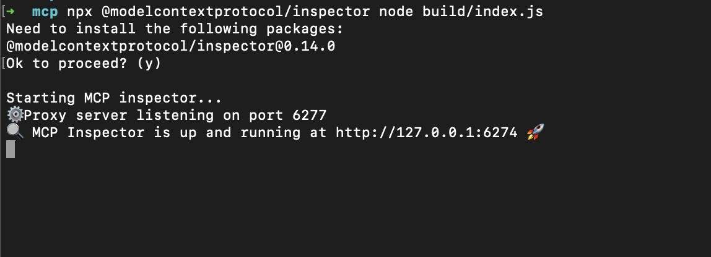
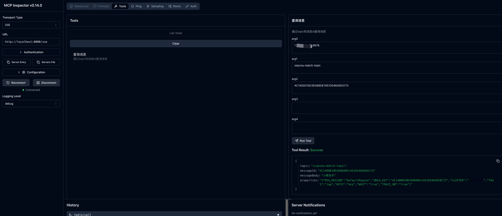
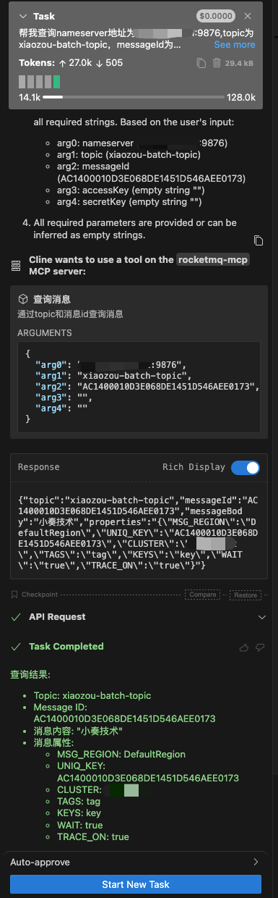
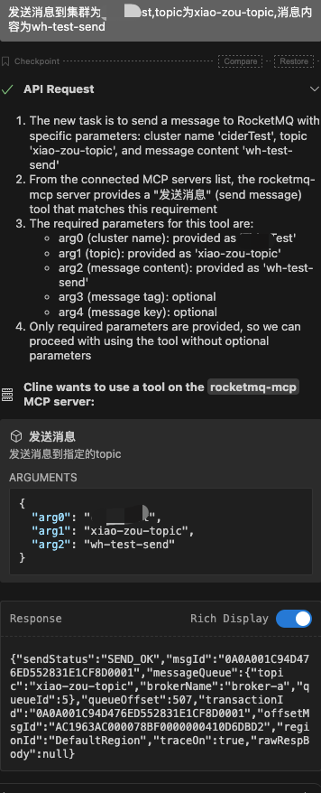

# rocketmq-mcp
Apache RocketMQ MCP Server


# use

1. 配置集群

1. 修改`application.yaml`文件，添加RocketMQ集群配置

```yaml
rocketmq:
  clusters:
    - id: 1
      name: xiaoZou
      namesrv-addr: 127.0.0.1:9876
```

2. 运行 [MCPApplication.java](src/main/java/com/rocketmq/mcp/MCPApplication.java)


3. 验证mcp server是否启动成功

- 安装 inspector

```shell
npx @modelcontextprotocol/inspector node build/index.js
```


- 打开浏览器访问 [http://127.0.0.1:6274/](http://127.0.0.1:6274/)



# 配置 mcp server

```json
{
  "mcpServers": {
    "rocketmq-mcp": {
      "url": "http://localhost:8081/sse",
      "disabled": false,
      "autoApprove": []
    }
  }
}
```

# 使用自然语言查询消息


```shell
查询集群为xiaozou，topic为xiao-zou-topic，消息id为AC1400010D3E068DE14531D104E40176的消息
```



# 使用自然语言发送消息

```shell
发送消息到集群为`xiaozou`,topic为`xiao-zou-topic`,消息内容为wh-test-send
```

